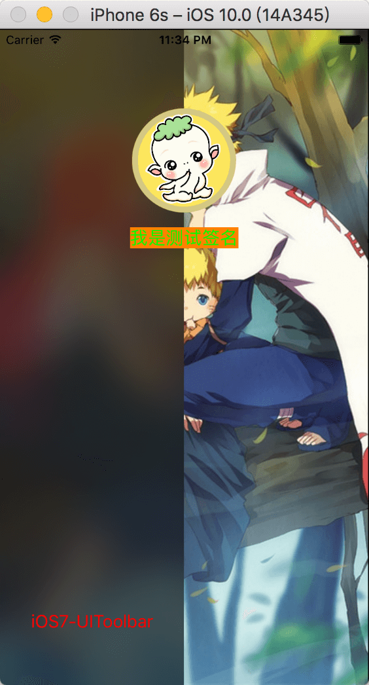
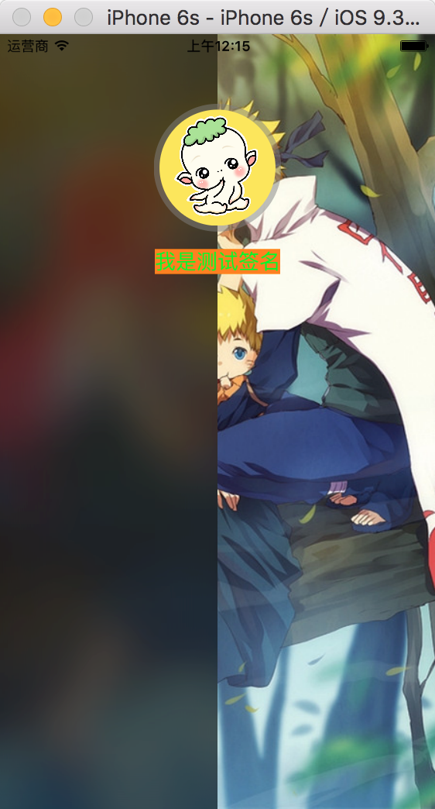

## iOS 中实现毛玻璃(高斯模糊)的三种方式
  * 第一, iOS7之前, 使用系统的 `UIToolbar` 这个类来实现
  * 第二, iOS8之后, 官方新增了 `UIBlurEffect` 这个类来实现, 它其实是直接在图片上面盖了一层View
  * 第三, 使用一个第三方的框架咯, [LBBlurredImage](https://github.com/lukabernardi/LBBlurredImage) 这个框架内部是直接对图片进行了渲染处理的
  * 说明: 前面两个是官方的, 使用起来比较高效, 第三方的效果显然也没有那么好看, 大家还是看需求使用吧
  * demo 中都有详细的实现代码可以参考, 需要用到的朋友可以 Clone or download 下来看看

### 放几张效果图: 
  * 第一张是用 `UIBlurEffect`实现的,  第二张是用`UIToolbar`实现的,  第三张是用`LBBlurredImage`实现的
<table>
 <tr>
  <td>
    
  </td>
  <td>
    
  </td>
  <td>
    
  </td>
 </tr>
</table>

